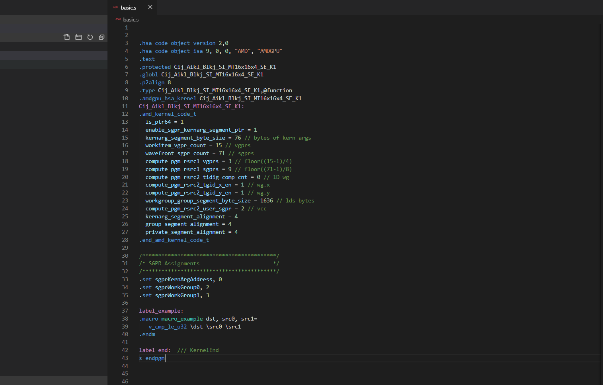

# Radeon Assembler Syntax Highlighting

## Syntax features

- Instructions highlighting
- Macro highlighting
- Label highlighting
- Collapse macro block

## Install extension

- Clone this repository: `git clone https://github.com/Slimakanzer/vscode-rad-syntax`
- Copy it into the `<user home>/.vscode/extensions` folder and restart Code.

## Preview

